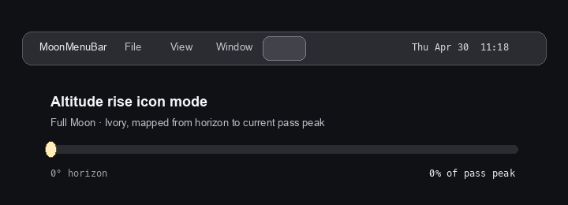

<div align="center">


# MoonMenuBar

**A quiet companion for the night sky — living in your menu bar.**

*Calm. Emotional. Romantic.*

<sub>조용히 달을 곁에 두는 macOS 메뉴바 앱</sub>

[](LICENSE)
[](https://github.com/woqhrl9494-cell/MoonMenuBar/releases)
[](https://swift.org)
[](https://github.com/woqhrl9494-cell/MoonMenuBar/stargazers)
[](https://github.com/woqhrl9494-cell/MoonMenuBar/releases/latest)


<br><br>



</div>

---

## Why MoonMenuBar

Most apps compete for your attention. This one doesn't.

The moon is easier to forget than the weather. MoonMenuBar tucks the current phase into your menu bar — a single glyph that shifts from 🌑 to 🌕 and back, night after night. No notifications. No feeds. Just a quiet reminder that something ancient is still moving overhead.

---

## Features

<table>
  <tr>
    <td>🌙 <strong>Phase icon</strong></td>
    <td>Live moon phase glyph in the menu bar, updated continuously</td>
  </tr>
  <tr>
    <td>💡 <strong>Moonlight brightness</strong></td>
    <td>Relative brightness (%) compared to a full moon, optionally shown beside the icon</td>
  </tr>
  <tr>
    <td>🧭 <strong>Altitude &amp; direction</strong></td>
    <td>Current moon altitude and compass bearing for your location</td>
  </tr>
  <tr>
    <td>🌘 <strong>Altitude rise icon</strong></td>
    <td>Optional altitude-aware icon that rises with lunar altitude, reaches center at 20°, then stays centered</td>
  </tr>
  <tr>
    <td>↕️ <strong>Display controls</strong></td>
    <td>Two grouped menu controls choose icon text and whether altitude is ignored, hidden below the horizon, or shown as a peek</td>
  </tr>
  <tr>
    <td>🔆 <strong>Adaptive icon brightness</strong></td>
    <td>Icon luminance scales with estimated moonlight intensity</td>
  </tr>
  <tr>
    <td>🎨 <strong>Custom moon style</strong></td>
    <td>Choose white, silver, ivory, or a warmer photo-inspired yellow, with an optional brighter yellow crater texture</td>
  </tr>
  <tr>
    <td>📍 <strong>Location-aware</strong></td>
    <td>Uses Core Location for your local sky</td>
  </tr>
  <tr>
    <td>🔐 <strong>Privacy-first</strong></td>
    <td>No network requests, no telemetry, no accounts</td>
  </tr>
  <tr>
    <td>🚀 <strong>Launch at login</strong></td>
    <td>Starts silently with macOS</td>
  </tr>
  <tr>
    <td>📦 <strong>Self-contained</strong></td>
    <td>Single <code>.app</code> bundle, no dependencies</td>
  </tr>
</table>

---

## Install

### Download (recommended)

[](https://github.com/woqhrl9494-cell/MoonMenuBar/releases/latest)

Download the latest `.dmg`, open it, and drag `MoonMenuBar.app` to `/Applications`.

> Move the app to `/Applications` before enabling **Launch at Login** — running directly from the DMG volume can make the login item unreliable.

### First launch on macOS

MoonMenuBar is an unsigned personal project, so macOS Gatekeeper may warn that the developer cannot be verified. If that happens, open **System Settings → Privacy & Security**, find the MoonMenuBar warning, and choose **Open Anyway**. You can also Control-click `MoonMenuBar.app` in `/Applications`, choose **Open**, then confirm **Open** once.

### Build from source

```bash
git clone https://github.com/woqhrl9494-cell/MoonMenuBar.git
cd MoonMenuBar
./build.sh
open MoonMenuBar.app
```

**Requirements:** macOS 14.0 Sonoma or later · Swift compiler · Xcode Command Line Tools

The build script produces `MoonMenuBar.app` and `MoonMenuBar.dmg` locally (both are gitignored).

---

## Recent Updates

- **Current** — Grouped the menu bar content and moon altitude behavior into two arrow submenus.
- **Current** — Altitude rise icon mode: hide/peek below the horizon, rise into center by 20° altitude, and hold centered above that threshold.
- **Current** — Updated the yellow moon palette and crater texture to better match a warm photographic full moon.
- **v1.1.4** — Customizable moon icon styles: white, silver, ivory, yellow, and optional moon surface marks.
- **v1.1.3** — Replaced the bundled app icon asset and attached an updated DMG.
- **v1.1.2** — Redesigned the app icon with a dark rounded-square moon phase design.

> See the [releases page](https://github.com/woqhrl9494-cell/MoonMenuBar/releases) for the full history.

---

## Screenshots

| Menu bar | Dropdown |
|:---:|:---:|
|  |  |

| Menu bar content options | Moon altitude options |
|:---:|:---:|
|  |  |

---

## How It Works

MoonMenuBar computes everything locally using a two-body astronomical model inspired by *Astronomical Algorithms* (Jean Meeus, 2nd ed.).

| Value | Method |
|---|---|
| Phase angle | Ecliptic longitude difference between Moon and Sun |
| Illumination % | `(1 − cos θ) / 2 × 100` where θ is the phase angle |
| Altitude / Azimuth | Equatorial → horizontal coordinate transform using your latitude, longitude, and local sidereal time |
| Altitude rise icon | `disabled`: centered icon; `hide`: no icon below horizon; `peek`: 20% floor below horizon; above horizon uses `progress = clamp(altitude / 20°, 0, 1)` |
| Icon brightness | Illumination mapped to display luminance |

**Transparency note:** The model is a fast approximation — it omits atmospheric refraction, terrain obstructions, clouds, and higher-order orbital perturbations. Expect accuracy within ~1° for altitude/azimuth and within ~1% for illumination under typical conditions. This is intentional: the goal is a lightweight, offline-first companion, not an ephemeris engine.

---

## A Note from the Author

Inspired by walks home under a half moon, and by Jean Meeus's *Astronomical Algorithms* — the book that quietly powers many moon-phase calculators.

---

## Privacy

- **No network requests.** Ever. The app never opens a socket.
- **No telemetry or analytics.** No crash reporters, no usage tracking.
- **Location data** stays on your device, processed entirely in-memory by Core Location.

---

## FAQ

<details>
<summary><b>Why does the altitude sometimes show negative?</b></summary>

A negative altitude means the moon is currently below your horizon — it has set (or hasn't risen yet) at your location. This is expected and correct. The next moonrise time will appear in a future update.

</details>

<details>
<summary><b>The brightness shows 0% but the moon is visible outside — what's wrong?</b></summary>

The brightness value is astronomical illumination, not sky brightness. Near new moon the illuminated fraction genuinely approaches 0%, even if scattered light or a thin crescent is visible to the naked eye in ideal conditions.

</details>

<details>
<summary><b>Launch at Login doesn't work when I enable it.</b></summary>

Make sure `MoonMenuBar.app` is in `/Applications`, not running directly from a mounted DMG. macOS's Login Items API requires the app to live in a permanent path.

</details>

<details>
<summary><b>Will there be an App Store version?</b></summary>

Possibly, once the app is notarized and the core feature set is stable. The open-source version will always remain available here.

</details>

---

## Contributing

Pull requests are welcome. For larger changes please open an issue first to discuss.

```bash
git clone https://github.com/woqhrl9494-cell/MoonMenuBar.git
cd MoonMenuBar
./build.sh   # verify everything builds before submitting a PR
```

Please keep commits focused: one logical change per commit.

---

## License

MIT — see [LICENSE](LICENSE) for details.

Built with care by [Jaebok Lee](https://github.com/woqhrl9494-cell) · ok7393@hanyang.ac.kr
