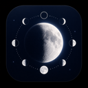
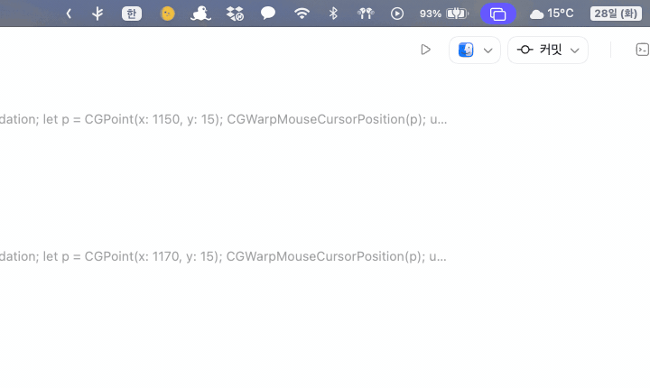
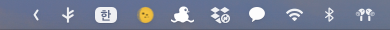
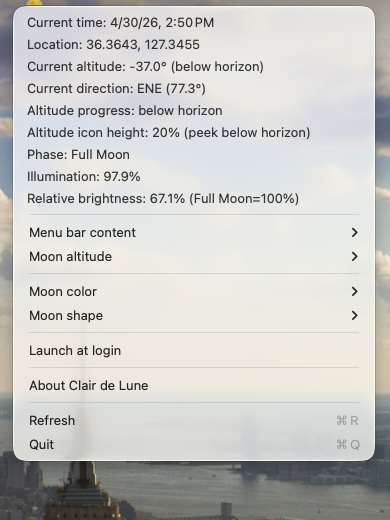
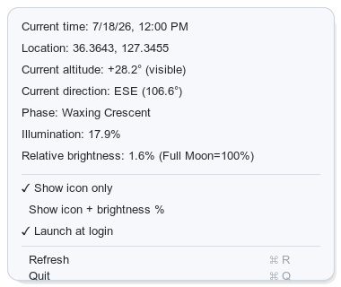
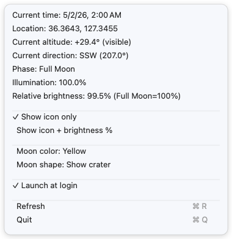

<div align="center">



# MoonMenuBar

**A quiet companion for the night sky — living in your menu bar.**

*Calm. Emotional. Romantic.*

[](LICENSE)
[](https://github.com/woqhrl9494-cell/MoonMenuBar/releases)
[](https://swift.org)
[](https://github.com/woqhrl9494-cell/MoonMenuBar/stargazers)
[](https://github.com/woqhrl9494-cell/MoonMenuBar/releases/latest)



</div>

---

## Why MoonMenuBar

Most apps compete for your attention.  
This one doesn't.

MoonMenuBar tucks the current moon phase into your menu bar — a single glyph that shifts from 🌑 to 🌕 and back, night after night. No notifications, no feeds, no noise. Just a quiet reminder that something ancient and beautiful is moving overhead.

Designed for people who find the night sky calming. For the moments you glance up from the screen and wonder what the moon looks like right now.

---

## Features

| | |
|---|---|
| 🌙 **Phase icon** | Live moon phase glyph in the menu bar, updated continuously |
| 💡 **Moonlight brightness** | Relative brightness (%) compared to a full moon |
| 🧭 **Altitude & direction** | Current moon altitude and compass bearing for your location |
| 🔆 **Adaptive icon brightness** | Icon luminance scales with estimated moonlight intensity |
| 📍 **Location-aware** | Uses Core Location for your local sky |
| 🔐 **Privacy-first** | No network requests, no telemetry, no accounts |
| 🚀 **Launch at login** | Starts silently with macOS |
| 📦 **Self-contained** | Single `.app` bundle, no dependencies |

---

## Install

### Download (recommended)

Grab the latest `.dmg` from the [**Releases page**](https://github.com/woqhrl9494-cell/MoonMenuBar/releases/latest), open it, and drag `MoonMenuBar.app` to `/Applications`.

> Move the app to `/Applications` before enabling **Launch at Login** — running directly from the DMG volume can make the login item unreliable.

### Build from source

```bash
git clone https://github.com/woqhrl9494-cell/MoonMenuBar.git
cd MoonMenuBar
./build.sh
open MoonMenuBar.app
```

**Requirements:** macOS · Swift compiler · Xcode Command Line Tools

The build script produces `MoonMenuBar.app` and `MoonMenuBar.dmg` locally (both are gitignored).

---

## Screenshots

| Menu bar | Dropdown |
|:---:|:---:|
|  |  |

| Waxing crescent | Full moon |
|:---:|:---:|
|  |  |

---

## How It Works

MoonMenuBar computes everything locally using a two-body astronomical model inspired by *Astronomical Algorithms* (Jean Meeus, 2nd ed.).

| Value | Method |
|---|---|
| Phase angle | Ecliptic longitude difference between Moon and Sun |
| Illumination % | `(1 − cos θ) / 2 × 100` where θ is the phase angle |
| Altitude / Azimuth | Equatorial → horizontal coordinate transform using your latitude, longitude, and local sidereal time |
| Icon brightness | Illumination mapped to display luminance |

**Transparency note:** The model is a fast approximation — it omits atmospheric refraction, terrain obstructions, clouds, and higher-order orbital perturbations. Expect accuracy within ~1° for altitude/azimuth and within ~1% for illumination under typical conditions. This is intentional: the goal is a lightweight, offline-first companion, not an ephemeris engine.

---

## Privacy

- **No network requests.** Ever. The app never opens a socket.
- **No telemetry or analytics.** No crash reporters, no usage tracking.
- **Location data** stays on your device, processed entirely in-memory by Core Location.

---

## Roadmap

- [ ] Moonrise / moonset times in the dropdown
- [ ] Next full moon / new moon countdown
- [ ] Menu bar icon morphing animation (smooth phase transitions)
- [ ] Configurable icon style (minimal / filled / emoji)
- [ ] Widgets for macOS Notification Center
- [ ] Apple Silicon notarized release on the Releases page
- [ ] Localization (Japanese · Korean · German)
- [ ] Optional gentle daily notification at moonrise

Have an idea? [Open an issue](https://github.com/woqhrl9494-cell/MoonMenuBar/issues/new) or vote on existing ones.

---

## FAQ

<details>
<summary><b>Why does the altitude sometimes show negative?</b></summary>

A negative altitude means the moon is currently below your horizon — it has set (or hasn't risen yet) at your location. This is expected and correct. The next moonrise time will appear in a future update.

</details>

<details>
<summary><b>The brightness shows 0% but the moon is visible outside — what's wrong?</b></summary>

The brightness value is astronomical illumination, not sky brightness. Near new moon the illuminated fraction genuinely approaches 0%, even if scattered light or a thin crescent is visible to the naked eye in ideal conditions.

</details>

<details>
<summary><b>Launch at Login doesn't work when I enable it.</b></summary>

Make sure `MoonMenuBar.app` is in `/Applications`, not running directly from a mounted DMG. macOS's Login Items API requires the app to live in a permanent path.

</details>

<details>
<summary><b>Will there be an App Store version?</b></summary>

Possibly, once the app is notarized and the core feature set is stable. The open-source version will always remain available here.

</details>

---

## Contributing

Pull requests are welcome. For larger changes please open an issue first to discuss.

```bash
git clone https://github.com/woqhrl9494-cell/MoonMenuBar.git
cd MoonMenuBar
./build.sh   # verify everything builds before submitting a PR
```

Please keep commits focused: one logical change per commit.

---

## License

MIT — see [LICENSE](LICENSE) for details.
